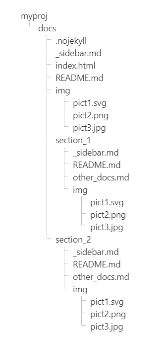

## Файлова організація документів

Файлова організація документів прив'язана до фолдеру проєкта, скажімо для наочності, `myproj`. Базовим субфолдером створюваної документації є `docs`. Типова файлова структура документації представлена на рисунку нижче:

## Пояснення і рекомендації

- У корені `docs` в результаті ініціалізації розташовані [три обов'язкові файли](install_tool.md#Створюйте-свій-вміст): `index.html`, `README.md` і `.nojekyll`.
- Файл `README.md` у кожному субфолдері грає роль посадкової сторінки (*landing page*) цього субфолдера. Наприклад, маєте на локальному комп'ютері файл `myproj/docs/subfolder1/README.md`, а базова веб-адреса вашого проєкту на *GitHub Pages* визначена `https://abc.github.io/myproj`. Тоді в результаті виклику у бравзері веб-адреси `https://abc.github.io/myproj/section1/` (остання коса риска `/` обов'язкова) ви перейдете на сторінку, що згенерована із зазначеного вище файлу `myproj/docs/section1/README.md`.
- Приймаємо деякі домовленості щодо найменівань файлів і фолдерів:
  - всі імена файлів і фолдерів документації (окрім `README.md`) сформовані з виключно маленьких літер латиною, а також знак підкреслення `_`;
  - імена фолдерів і файлів не починаються зі знака підкреслення `_` окрім службових файлів, визначених документацією `docsify`, як-то  `_sidebar.md` та інші подібні;
  - намагайтеся формувати імена файлів і фолдерів якамога коротшими і, водночас, семантично значимими.
- Для створення таблиці змісту на бічній панелі у кожному субфолдері створіть файл `_sidebar.md`, що власне міститиме список посилань на документи зазвичай у цьому ж субфолдері.
- Заголовки в окремому документі з'являються динамічно як елементи таблиці змісту на бічній панелі після натискування на посилання на цей документ. Вкладеність заголовків, що з'являється на бічній панелі, визначена у [налаштуваннях індексного файлу](tool_setting.md#Прості-налаштування) параметром `subMaxLevel`. 
- Посилання на заголовки документа створюються за подібним прикладом `[налаштуваннях індексного файлу](tool_setting.md#Прості-налаштування)`. Тут у стандартну побудову посилання на документ після імені файлу ставиться знак `#`, а за ним - ім'я заголовку, в якому всі внутрішні пробіли замінені на короткий дефіс `-`.
- Зображення розміщаємо субфолдерах кожного розділу. Наприклад, для розділу, що міститься у субфолдері `section1` зображення розміщаємо у субфолдері `section1/img`. Відповідно всередині документів цього розділу зображення вставлятимуться подібним образом: ``. Загальні для всього проєкту зображення містяться у субфолдері `myproj/docs/img`.
- Зазначте, що адресація ресурсів відносна субфолдера розділу. Це визначено у параметром `relativePath` у [налаштуваннях індексного файлу](tool_setting.md#Прості-налаштування).
