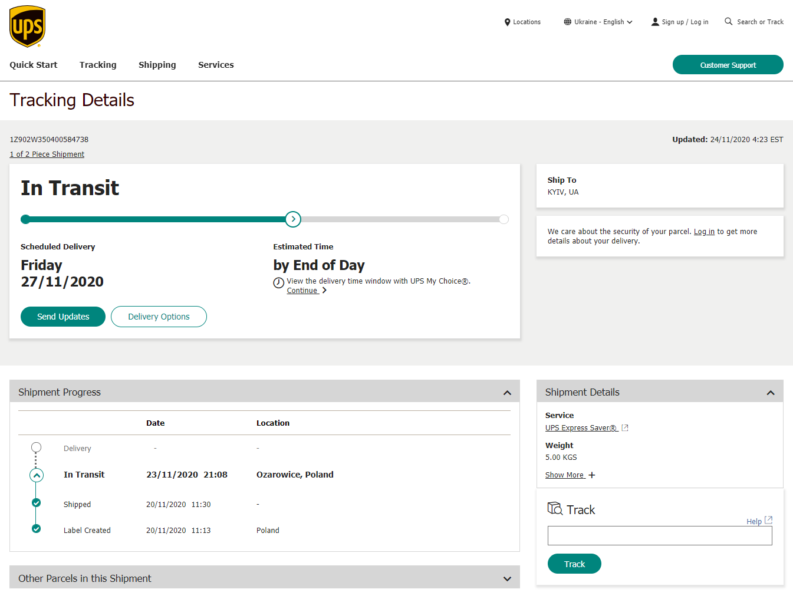

## Від задуму до початку реалізації

| №   | Дата | Подія |
| --- | ---- | ----- |
| 1   | січень 2018 | Формування проєктної ідеї, підготовка та подання проєктної пропозиції на Г2020 |
| 2   | лютий 2018 - березень 2019 | Доопрацювання та розвиток проєктної ідеї, пошук потенційних партнерів |
| 3   | 6 березня 2019 | Подання проєктної заявки на конкурс Громадського Бюджету 2020го року, публікація проєкту на ресурсі ГБ |
| 4   | 14 березня - 7 квітня 2019 | Експертна перевірка проєкту комісією ГБ, у тому числі: |
|     | 25-26 березня 2019 | Отримання проєктом негативного висновку та його оскарження |
| 5   | 8 квітня 2019 | Отримання проєктом позитивного висновку та допуск до голосування |
| 6   | 15 травня - 6 червня 2019 | Голосування за проєкти ГБ 2020 |
| 7   | 7 червня - 19 червня 2019 | Підрахунок голосів та прийняття рішень щодо переможців ГБ 2020 |
| 8   | 20 червня 2019 | Отримання статусу переможця ГБ 2020 |
| 9   | **22 червня 2019** | [**Проєкт ГБ 2020 № 1300 _AirZOOM - безпечне повітря для твоєї дитини - мобільна мережа моніторингу якості повітря_ знаходиться на реалізації**](https://gb.kyivcity.gov.ua/projects/11/1300) |
| 10  | **25 вересня 2020** | Дата оприлюднення замовником (КП Інформатика) інформації про проведення процедури торгів для тендерних закупівель датчиків по проєкту |
| 11  | 26 вересня - 12 жовтня 2020 | Проведення додаткових процедур за правилами проведення торгів (строки на звернення за додатковими роз'ясненнями та оскарження умов закупівлі) |
| 12  | 13-19 жовтня 2020 | Проведення процедури тендерних закупівель датчиків вимірювання якості атмосферного повітря компанії _Airly_ через систему Prozorro |
| 13  | **19 жовтня 2020** | [**Визначення переможця торгів за тендерною процедурою - компанція ТОВ Укрекоконсалт**](https://prozorro.gov.ua/tender/UA-2020-09-25-012663-a) |

!> **Помилки немає:** п. 9 - 22 червня **2019** і наступний крок - п. 10 25 вересня **2020** розділяють 1 рік і 3 місяці. Тобто замість того, щоб почати проєкт разом з початком 2020 року, команда майже 9 місяців примушувала велетенську бюрократичну махіну КМДА виправляти їхні ж помилки і рухатись у накресленому напрямку.

## Закупівля і відправлення датчиків

**20 жовтня 2020** - Датчики закуплені, відправлені Постачальником через сервіс поштової доставки  UPS і вже на шляху до місця призначення:

